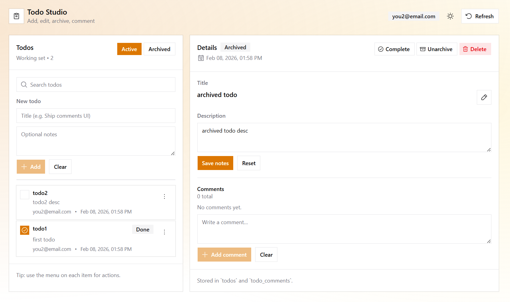

# Todo

A tiny Next.js + Supabase app using **server-first authentication**.



## Auth Model

- Supabase manages sessions via HTTP-only cookies
- Next.js middleware refreshes sessions
- Server Components read auth state
- Client Components only trigger login/logout

## Files

- `lib/supabase/client.ts` → browser-only client
- `lib/supabase/server.ts` → server auth + DB access
- `lib/supabase/proxy.ts` → middleware session refresh
- `proxy.ts` → Next.js middleware entry

## Server Auth (source of truth)

```ts
const supabase = await createClient();
const {
  data: { user },
} = await supabase.auth.getUser();
```

## Client Actions

```ts
await supabase.auth.signInWithPassword(...)
await supabase.auth.signOut()
router.refresh()
```
